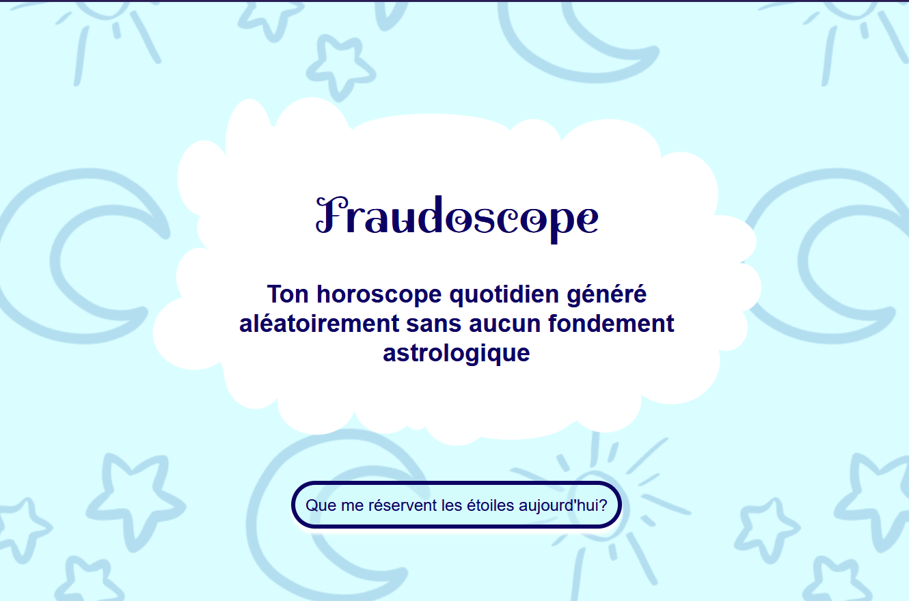
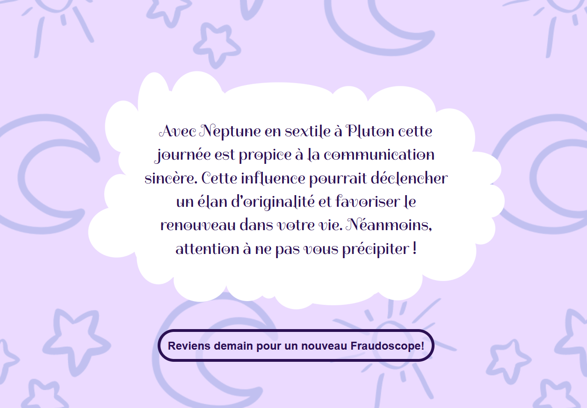

# Fraudoscope

>[!WARNING]
>Ce programme n'est pas terminé et est encore développement

## Description:
Le fraudoscope est un site qui génère *aléatoirement* un message du type horoscope a partir de 3 phrases choisies au hasard.

## Contenu:
- 1 fichier HTML: main.html
- 2 fichiers CSS:
    - style.css pour la page d'accueil
    - styleClicked.css pour l'affichage des résultats
- 2 fichiers JS:
    - messageGenerator.js pour la génération du message de l'horoscope
    - displayResult.js qui gère la modification de la page et l'affichage du résultat après le click

## Aperçu :

>[!NOTE]
>Ce programme a été réalisé dans le cadre de la formation de développeur Full-Stack de Codecademy.com
